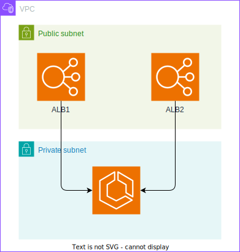

# Terraform + ecspresso AWS Infrastructure

このプロジェクトは、Terraformとecspressoを使用してBlue-Greenデプロイメント対応のクラウドインフラストラクチャを管理します。

## 構成

- **VPC**: Virtual Private Cloud、パブリック・プライベートサブネット、NATゲートウェイ（Terraform管理）
- **ALB**: Application Load Balancer（Web用、API用）（Terraform管理）
- **ECS**: ECS Fargate with Blue-Greenデプロイメント（ecspresso管理）
- **Lambda**: ECSデプロイメントフック（Terraform管理）

## 役割分担

- **Terraform**: インフラストラクチャの基盤リソース（VPC、ALB、IAMロール、Lambda等）
- **ecspresso**: ECSサービスとタスク定義の運用設定（デプロイ、スケーリング等）



## ディレクトリ構造

```
.
├── main.tf                 # メインの設定ファイル
├── variables.tf            # 変数定義
├── ecspresso.yml           # ecspresso設定ファイル
├── ecs-task-def.json       # ECSタスク定義（ecspresso管理）
├── ecs-service-def.json    # ECSサービス定義（ecspresso管理）
├── modules/
│   ├── vpc/               # VPCモジュール
│   │   ├── main.tf
│   │   ├── variables.tf
│   │   └── outputs.tf
│   ├── alb/               # ALBモジュール
│   │   ├── main.tf
│   │   ├── variables.tf
│   │   └── outputs.tf
│   ├── ecs/               # ECSモジュール（最小構成）
│   │   ├── main.tf
│   │   ├── variables.tf
│   │   └── outputs.tf
│   └── ecs_hook/          # ECSデプロイメントフック
│       ├── main.tf
│       ├── variables.tf
│       ├── outputs.tf
│       ├── src.zip
│       └── src/
│           └── index.py
├── .devcontainer/         # 開発環境設定
│   ├── devcontainer.json
│   └── Dockerfile
├── .tflint.hcl            # TFLint設定
├── .pre-commit-config.yaml # pre-commitフック設定
├── .gitignore             # Git除外設定
├── CLAUDE.md              # Claude設定ファイル
└── Makefile               # 開発用コマンド集
```

## セットアップ

### 1. AWS認証情報の設定

```bash
aws configure
```

### 2. Terraform初期化

```bash
terraform init
# または
make init
```

## 使用方法

### 基本的なワークフロー

```bash
# 1. 初期化
make init

# 2. フォーマット
make fmt

# 3. 検証とLint
make validate
make lint

# 4. 実行計画の確認
make plan

# 5. インフラストラクチャのデプロイ
make apply

# 6. ECSサービスのデプロイ
make ecs-deploy

# 7. インフラストラクチャの削除
make destroy
```

### ecspresso コマンド

```bash
# ECSサービスのデプロイ
make ecs-deploy

# ECSサービスの状態確認
make ecs-status

# ECSサービスの差分確認
make ecs-diff

# ECSサービスの検証
make ecs-verify

# ECSサービスのロールバック
make ecs-rollback

# ecspresso設定のレンダリング
make ecs-render
```

### 開発ワークフロー

```bash
# 開発用の一連のコマンドを実行
make dev
```

### 品質チェック

```bash
# 全品質チェック（format, validate, lint, security）
make quality
```
